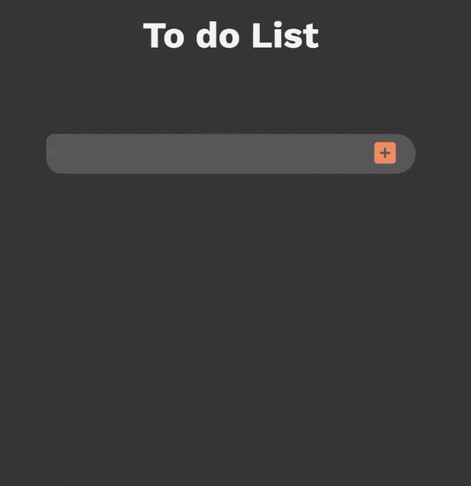

<!-- Interactive JavaScript Header -->

  <h1>JavaScript Practice Repository</h1>
  
Welcome to my JavaScript Practice Repository! This repository serves as a platform for me, to learn and improve my skills in JavaScript.

  

## Purpose

The primary purpose of this repository is to:

- Learn and understand core JavaScript concepts.
- Explore advanced topics, such as ES6, asynchronous programming, and functional programming.
- Build practical projects to apply my knowledge in real-world scenarios.
- Collect and share useful code snippets for reference and collaboration.
- Document my learning progress and experiences.

Thank you for visiting my JavaScript Practice Repository. Happy coding!

## Tiny Projects

### <a href="https://github.com/tanaymo7/Javascript/tree/main/to-do">✅ @1</a> To-Do list

